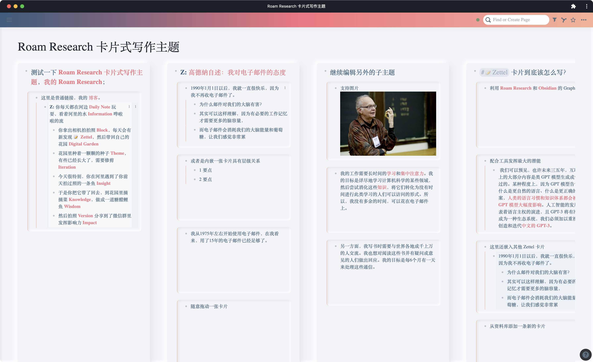
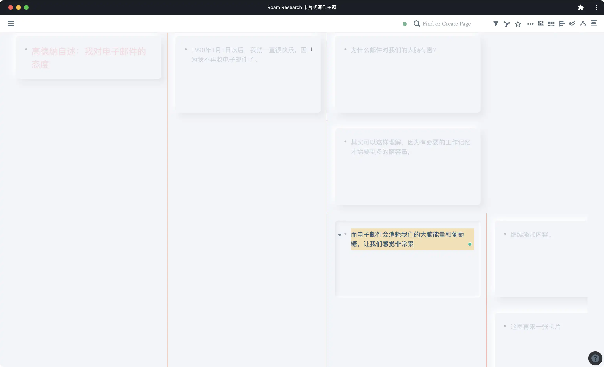

<link rel="stylesheet" href="/public/yue.css">

# Styled Roam (Research)

Roam Research ✍️ Writing with your lovely cards 🧩 and beautiful theme 🎨

> My custom CSS and JavaScript extension for [Roam Research](https://roamresearch.com)

🆕 [#roam𐃏files](https://twitter.com/hashtag/roam%F0%90%83%8Ffiles?src=hashtag_click) Roam Research ✍️ [Files Attachment Dashboard](./ROAM_FILES.md) 🗃

## Quick Start

1. Add a `{{[[roam/js]]}}` block firstly
2. Add a **CHILD** block `/JavaScript Code Block` with this code...

```js
window.URLScriptServer = `https://styled-roam.vercel.app/`
window.styledRoamDisabledFeatures = [
  // 'CardListMode',
  // 'CardFlowMode',
  // 'TreeTableMode',
  // 'DocumentMode',
  // 'CalendarMode',
  // 'DownloadMode',
  // 'FocusMode',
]

var existing = document.getElementById('styled-roam')
if (!existing) {
  var extension = document.createElement('script')
  extension.src = window.URLScriptServer + 'js/index.js'
  extension.id = 'styled-roam'
  extension.async = true
  extension.type = 'text/javascript'
  document.getElementsByTagName('head')[0].appendChild(extension)
}
```

3. Press the **BIG RED** button to enable the script


## Quick Review






Related Twitter:

- https://twitter.com/Jimmy_JingLv/status/1304451043594387456?s=20
- https://twitter.com/Jimmy_JingLv/status/1343897637255143424?s=20
- https://twitter.com/Jimmy_JingLv/status/1305893239187103749?s=20
- https://twitter.com/Jimmy_JingLv/status/1376741905485033476?s=20
- https://twitter.com/Jimmy_JingLv/status/1462101666732335104?s=20

## Basic Usage

配合 Candy 主题食用最佳，当然其他主题也好看，😉

```css
@import url('https://cdn.jsdelivr.net/gh/JimmyLv/Roam-Research-Themes/Candy.css');
```

## References

- [dvargas92495/roam-js-extensions](https://github.com/dvargas92495/roam-js-extensions)
- [Roamcult Themes](https://roamresearch.com/#/app/help/page/fJRcVITNY)
- [palashkaria/roam-modifiers: userscripts/custom CSS files for Roam Research](https://github.com/palashkaria/roam-modifiers)
- [roamhacker/roam42: Level up Roam with power user features. Automation, keyboard nav, dictionary, live preview and more.](https://github.com/roamhacker/roam42)
- [yoyooyooo/roam-enhance: Enhance roam reasearch, similar to roam42's smartblock, except that it is triggered by a right-click menu](https://github.com/yoyooyooo/roam-enhance)
